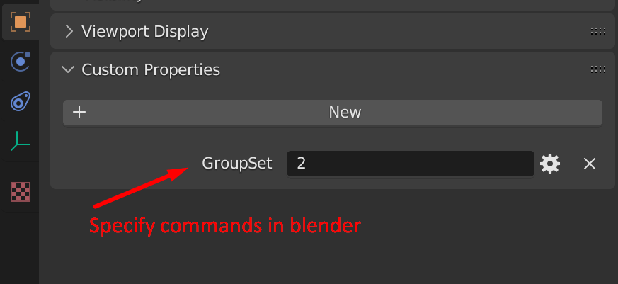
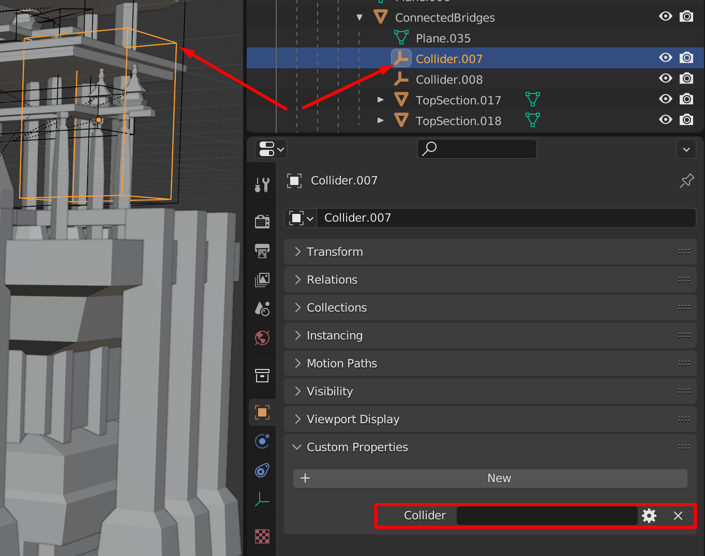

# TowerGenerator Unity submodule
## Example projects
* https://github.com/cholushkin/SciFiCityGenerator

## FBX commands
FBX commands are properties that you can add in Blender to hierarchy elements. After Blender file is exported to Unity as FBX these propreties works as commands that configures **TowerGenerator Chunks**.
Each command could have from zero to several parameters. Parameters could be omitted then the default values take place. [Also see printable cheat sheet version](https://docs.google.com/spreadsheets/d/1sefKKZGdllpTpHPTX2AZMRrZCT5wT7QiN8GhPCoiGW4/edit?usp=sharing).


### GroupSet
-------------------
Adds GroupSet component to the node which makes the node be able to randomly enable some subset of its children. 

| Parameter | Description |
| --- | --- |
| int MinObjectsSelected = 0 | Minimum amount of items this GroupSet could activate |
| int MaxObjectsSelected = ChildrenNumber | Maximum amount of items this GroupSet could activate |

```
Examples:
GroupSet( ) // Enable from 0 to maximum children contained in this node.
GroupSet( 0, 2 ) // Enable from 0 to 2 children.
GroupSet( 1 ) // Enable from 1 child to maximum children amount in this node.
GroupSet( 1, 1 ) // Very common usecase - enable only one child of all available children in this node.
```

### GroupStack
-------------------
Adds GroupStack component to the node which makes nested nodes elements act as a stack elements. The stack could turn on contained elements sequentially one after another.

| Parameter | Description |
| --- | --- |
| int MinIndexSelected = -1 | Index of element which represents minimum possible stack level.|

Let's assume that the stack node contains 3 elements with corresponding indexes 0,1,2.
```
Examples:
GroupStack( ) // Enable randomly one of the stack state: xxx(all disabled), 0xx, 01x, 012(all enabled) 
GroupStack( 0 ) // MinimumIndexSelected = 0. Possible states are: 0xx, 01x, 012
GroupStack( 1 ) // Possible states are: 01x, 012
```

### ChunkController	
-------------------
Adds ChunkController to the node. ChunkController mostly controls randomization of the chunk.	

| Parameter | Description |
| --- | --- |
| ChunkController ChunkControllerType = BasicChunkController | Sprecifies type of chunk controller. Possible values: BasicChunkController/           WaveFuncCollapseChunkController/GrowingChunkController/MarchingCubesChunkController |
| string[] ChunkTagSet = null | Set of quick-add tags. You also can add tags by Tag FBX command. |

```
Examples:
ChunkController() // By default parameters are: BasicChunkController, null
ChunkController(BasicChunkController, ChunkTopEar, ChunkPeak, BiomeJungle, ArchitectureCubism)
```

### Connector
----------
Make this node a connector. Chunks connect with each other using connectors.
| Parameter | Description |
| --- | --- |
| ConnectorType ConnectorType = Pin+Hole | Type of pin. Could be: Pin, Hole and Pin+Hole |
| string[] ConnectExpressions = null | List of expressions that filter out supported by this connector chunks |

```
Examples:
Connector(Pin|Hole, ChunkStandard and !Cute and ArchitectureDeconstructivism, not ArchitectureCubism)
```

### GeneratorConnector
-----------
Same as Connector but instead it connects an entire generator. 
| Parameter | Description |
| --- | --- |
| string[] GeneratorConnectExpressions = null |  List of expressions that filter out supported by this connector generators |

```
Examples:
GeneratorConnector(Creature or Decoration or Scrub)
```

### Set	
--------------
Sets the value of the property for the Unity component. If there is no component add it. Support multiple components per unity GameObject.

| Parameter | Description |
| --- | --- |
| string ComponentNameAndIndex = null | Name of Unity component and index for multiple component |
| string PropertyNameAndValue = null | Name of the parameter and value to set |
	
```
Examples:
Set(HoveringLocal[0], AlongVector=(0,1,0)) // [0] for support of multiple scripts with the same name. 
Set(HoveringLocal, AlongVector=(0,1,0)) // Same effect as the previous one. 0 index could be omitted. 
Set(SoundEffect) // Add SoundEffect script to GameObject
Set(SoundEffect[1], ID="Boom") // Add second SoundEffect script and specify value for the ID property.
```

### Suppression
-----------------
Make this node suppress other nodes (disable them) when activated using suppression labels. Suppressed nodes are specified by FBX command SuppressedBy. If there is no any labels passed to Suppression then all nodes which have SupressedBy without parameters will be suppressed.	
| Parameter | Description |
| --- | --- |
| string[] SuppressionLabels = null | List of labels which acts like suppression events sent to current chunk. |

```
Examples:
Suppression() // Suppress all SuppressedBy nodes without parameters
Suppression(Tube,Pipe) // Supress all SuppressedBy nodes which has 'Tube' or 'Pipe' parameters 
```

### SuppressedBy
-----------
Make this node suppressed by (disabled by) Suppression nodes with coresponding labels.
| Parameter | Description |
| --- | --- |
| string[] SuppressionLabels = null | List of supression labels by which this node will be supressed. |

```
Examples:
SuppressedBy(Tube,Pipe) // This node is suppresed by Supression node with Tube or Pipe parameter
SuppressedBy( ) // Make this node suppressed by all Supression nodes without parameters
```

### Induction
--------------
Make this node induct other nodes on activation using induction labels. Induced nodes are specified by FBX command InducedBy.	
| Parameter | Description |
| --- | --- |
| string[] InductionLabels = null | List of labels which acts like induction (activation) events sent to current chunk |

```
Examples:
Induction() // Induces all InducedBy nodes without labels within current chunk
Induction(Tube, Pipe)
```

### InducedBy
--------------
Make this node induced by Induction nodes with coresponding labels.
| Parameter | Description |
| --- | --- |
| string[] InductionLabels = null | List of induction labels by which this node will be induced. |

```
Examples:
InducedBy() // Induced by every Induction node without parameters
InducedBy(Pipe) // Induced by Induction nodes with the command Induction(Pipe)
InducedBy(Tube,Pipe,LargePillar) // Induced by Induction nodes: Induction(Tube), Induction(Pipe) or Induction(LargePillar)
```


### CollisionDependent
------------------------
Add CollisionDependent component to the node which makes node/chunk auto disabled if collision accures.
| Parameter | Description |
| --- | --- |
| FragmentRelation FragmentDomination = Submissive| Possible values: Submissive/Dominant. Submissive nodes get disabled when collision happened during instantiation of neighbor chunk. Dominant node will not allow neighbur/current chunk to spawn if collision happened in neigbor/current chunk.
| CollisionCheck CollisionCheck = AABB | Possible values: AABB/ConvexHull/Mesh. Specifies collision check method. |

```
Examples:
CollisionDependent( ) // By default FragmentDomination will be Submissive
CollisionDependent( Dominant ) // Make fragment disable other collided segments"
```


### AddCollider
-------------------
ChunkImportSource.AddColliders specifies should chunk importer add mesh colliders or not to all objects in the chunk. AddCollider FBX command indicates to add collider to specified node in the chunk even if ChunkImportSource.AddColliders equals to 'false'.

_No parameters_

```
Examples:
AddCollider()
```

### IgnoreCollider
-------------------
ChunkImportSource.AddColliders specifies should chunk importer add mesh colliders or not to all objects in the chunk. IgnoreCollider FBX command indicates to ignore adding collider to specified node in the chunk even if ChunkImportSource.AddColliders equals to 'true'.

_No parameters_

```
Examples:
IgnoreCollider()
```

### Collider
-------------------
Defines a geometry of custom user collider specified by set of boxes.



_No parameters_

```
Examples:
Collider()
```


### DimensionsIgnorant
----------------------
Makes fragment ignored for dimension calculation of the chunk.

_No parameters_

```
Examples:
DimensionsIgnorant()
```
### Hidden
-----------
Make this node be in disabled state by default. Some objects don't change their state by groups (GroupSet/GroupStack). They could change the state by 'induction' or 'suppress'. In case you need to hide some objects initially you use 'Hidden' FBX command.	

_No parameters_
```
Examples:
Hidden()
```

### Generation
----------
Assign generation number for the chunk. Chunk generation helps to filter set of all available chunks by the specific group id (generation). Later on when new generation of chunks added to the build the old consistency of seed based random result will not be broken. The process of generation always works on a specified range of generation IDs currently available in a build.
| Parameter | Description |
| --- | --- |
| uint Generation = 0 | Generation number of this chunk |

```
Examples:
Generation(2)
```

### Tag
------------
Defines tag value for specified node inside the chunk. Could also be applied to the chunk directly. 
| Parameter | Description |
| --- | --- |
| string TagName | Name of the tag in the CamelCase. Has no default value. |
| float01 TagValue = 1f | Value of the tag from 0f to 1f. |


```
Examples:
Tag(Setting.Tech, 0.5) // 50% of tech setting for this chunk
Tag(TreasureChest) // Could be applied to the connector to make it spawn treasure chests only (decoration)
```


### ToDo FBX commands
* Collider - make this node's geometry be a collider for mesh collider. Ignore import but take geometry for collider mesh.
* IgnoreImport - ignore the node and its children. Could be useful to delete some proxy-auxiliary geometry in the model.
* RandomScaleRange - scale node in specified range on instantiation. float FromScale | float ToScale
* RandomScaleValues - scale node by one of the value from the list. For example RandomScaleValues( 1.0, 2.0, 4.0 )
* AddAABBSizeMultiplier(2.0) "if (ExpandAABBMargin) bounds.Expand(Vector3.one * Meta.ChunkMargin * 2f);"
* AddAABBMargin(2.0) "if (ExpandAABBMargin) bounds.Expand(Vector3.one * Meta.ChunkMargin + 2f);"
* Induction and Suppression has a parameter that allows to propogate to neigbour chunks
